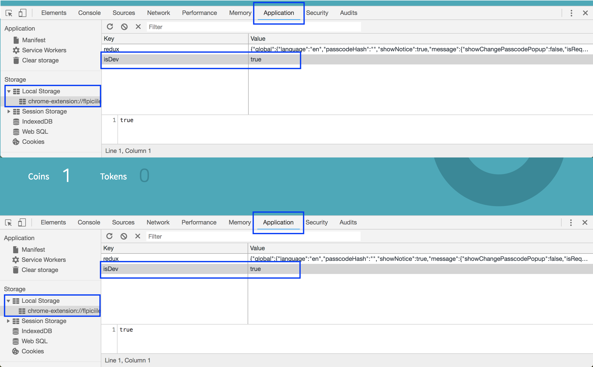

# **Part 2. HelloWorld on testnet**

## **ICONex 설치 및 테스트넷 연결하기**

ICON 크롬 확장프로그램을 설치 [[링크]](https://chrome.google.com/webstore/detail/iconex/flpiciilemghbmfalicajoolhkkenfel)

ICON 크롬 지갑을 설치 시 기본적으로 메인넷에 연결되어 있습니다. 메인넷이 아닌 테스트넷에서 실습하기 위해 설정을 변경해야합니다.

* `F12` 를 눌러 크롬 개발자도구를 열고, `Application` 탭으로 이동합니다. 
* `Storage` 의 `Local Storage` 에 기존 데이터를 덮어쓰지 않고, 새로운 `key/value` 를 추가합니다. **(isDev/true)**



* key/value 추가 후 지갑을 새로고침하면, 브라우저 화면 하단에 네트워크 선택창이 생성된 것을 확인할 수 있습니다. 생성된 선택창을 통해 메인넷에서 DApp 개발자를 위해 제공되는 YEOUIDO 테스트넷으로 설정을 변경합니다.


---

## **ICONex에서 지갑 생성 및 백업하기**

ICONex를 통해 지갑을 생성 및 백업 할 수 있습니다.<br /> 아이콘에서 제공하는 여러 도구를 통해 지갑을 생성하는 방법은 [링크](https://www.icondev.io/docs/account-management#section-create-an-account)를 통해 확인할 수 있습니다.

테스트넷에서 실습을 하는 동안, 생성한 지갑을 사용하도록 하겠습니다.
ICONex를 통해 백업한 지갑의 경우 `UTC--2018-10-06T06_00_02.195Z--hxbac99ffea54749ca1c86ab4e6bfe0b630bf7a7a0` 와 같이 해당 지갑의 주소 `hxbac99ffea54749ca1c86ab4e6bfe0b630bf7a7a0` 를 포함한 파일명을 가지고 있습니다. 실습 간 가독성을 위해 `keyfile_test2`로 파일명을 변경하여 사용하겠습니다.

---

## **테스트 ICX 요청하기**

테스트넷에서는 SCORE 배포, 메소드 호출 등 모든 트랜잭션의 실행에 수수료가 요구됩니다.
`testicx@icon.foundation` 로 테스트용 ICX를 요청할 수 있으며, 신청시 요구되는 정보들은 다음과 같습니다.

* 테스트넷 노드의 url
* 테스트 ICX를 받을 주소 (실습을 따라하며 생성한 지갑 주소 권장)

T-Bears CLI 또는 ICONex를 통해 주소의 ICX 잔고를 확인할 수 있습니다.

```bash
tbears balance [account] -u https://bicon.net.solidwallet.io/api/v3
```

---

## **수수료**

수수료에 대한 설명은 [링크](https://github.com/icon-workshops/Dive-into-ICON-2-SCORE/blob/master/docs/transaction_fees.md)를 통해 확인할 수 있습니다.

* 트랜잭션 요청 메시지의 `stepLimit`<br />
모든 트랜잭션 요청 메시지에는 `stepLimit` 이 포함되어 있습니다. `stepLimit` 은 거버넌스 SCORE에서 설정한 `maximum step limit` 보다 큰 값으로 설정할 수 없습니다.

```json
{
    "jsonrpc": "2.0",
    "method": "icx_sendTransaction",
    "id": 1234,
    "params": {
        "version": "0x3",
        "from": "hxe7af5fcfd8dfc67530a01a0e403882687528dfcb",
        "to": "cx9a4c4229ab2cbd61a5cc051fbbb6ee7e3e3adfac",
        "stepLimit": "0x123450",
         ...
```

* 트랜잭션 요청 결과의 `stepUsed`<br />
모든 트랜잭션 요청 결과에는 `stepUsed` 가 포함되어 있습니다. `stepUsed`은 해당 트랜잭션이 실행되며 실제로 사용된 step의 양을 나타냅니다.<br />
T-Bears 환경에서도 역시 모든 트랜잭션에 대한 결과에서 확인할 수 있으며, 이를 바탕으로 실제 요구되는 step의 양을 도출할 수 있습니다. 만약 `stepUsed` 값이 트랜잭션 요청 시 설정한 `stepLimit` 값보다 커지는 경우, `Out of step` 에러를 반환합니다. <br /> **T-Bears 환경의 경우 step price가 '0' 으로 설정되어 있어 실제로 수수료를 요구하지는 않습니다.**

```json
{
    "jsonrpc": "2.0",
    "result": {
        "txHash": "0xc40cbbf2b89cd1e2890....",
        "blockHeight": "0x3158",
        "blockHash": "0x9e0c1385128bf0d4257....",
         ...
        "stepUsed": "0x4d361d0",
         ...
```

* 트랜잭션 요청 결과의 `Out of step`<br />
트랜잭션 요청 결과로 `Out of step`이 반환된 경우, 트랜잭션 요청 시 설정한 `stepLimit`을 값을 키워 `stepUsed` 값보다 큰 값이 되도록 설정해야 합니다.  
```json
{
    "jsonrpc": "2.0", 
    "result": {
        "txHash": "0x9f512fe4b431d8780d75c29ad307f3....", 
        ...
        "stepUsed": "0x4d361d0",
        "status": "0x0", 
        "failure": {
            "code": "0x7d64", 
            "message": "Out of step: contractSet"
        }
        ...
```

---

## **T-Bears CLI 테스트넷 연결하기**

`tbears_cli_config.json` 파일의 `uri`, `nid`, `stepLimit` 설정을 수정하는 것으로, T-Bears CLI의 네트워크를 변경할 수 있습니다.
> `-u` 옵션이 생략된 모든 CLI 명령은 config 파일의 uri로 요청을 보냅니다.<br/>
> `deploy`는 config 파일의 `nid`, `stepLimit` 설정을 사용합니다.

```json
{
    "uri": "https://bicon.net.solidwallet.io/api/v3",
    "nid": "0x3",
    "keyStore": null,
    "from": "hxe7af5fcfd8dfc67530a01a0e403882687528dfcb",
    "to": "cx0000000000000000000000000000000000000000",
    "stepLimit": "0x5000000",
    ...
}
```

---

## **hello_world 테스트넷 배포하기(T-Bears CLI)**

T-Bears 환경과 달리, 테스트넷 환경에서는 모든 트랜잭션 요청을 보낼 때 사용자의 서명이 요구됩니다. **사용자는 본인의 지갑을 통해 서명을 할 수 있습니다.**

`tbears deploy` 명령에 `-k [keystore_file]` 옵션을 추가하여 테스트넷에 SCORE를 배포할 수 있습니다. 별도의 설정이 없다면, 네트워크 정보(nid, uri)는 default config 파일의 설정을 따릅니다.

```bash
root@07dfee84208e:/tbears# tbears deploy hello_world -k keystore_test2
root@07dfee84208e:/tbears# tbears txresult [txhash]
```

> `txhash` 를 통해 조회한 트랜잭션 결과에서 SCORE 주소를 확인할 수 있습니다.

---

## **hello 메소드 호출하기(T-Bears CLI, Python)**

### **T-Bears CLI**

**Read-only** 메소드를 호출하는 경우 키스토어 파일이 요구되지 않습니다. default config 파일의 내용이 반영되므로, `call.json` 파일의 `to` 와 `from` 설정 부분만 확인 후 함수를 호출할 수 있습니다.

```bash
root@07dfee84208e:/tbears# tbears call call.json

root@07dfee84208e:/tbears# cat call.json 
{
    "jsonrpc": "2.0",
    "method": "icx_call",
    "id": 1,
    "params": {
        "from": "hxbac99ffea54749ca1c86ab4e6bfe0b630bf7a7a0",  <-- test2 address
        "to": "cx9a4c4229ab2cbd61a5cc051fbbb6ee7e3e3adfac",  <-- SCORE address on testnet 
        "dataType": "call", 
        "data": {
            "method": "hello" 
        }
    }
}
```

### **Python SDK**

Python SDK를 활용하여 `hello` 메소드를 호출하는 `hello.py` 를 작성해보겠습니다.
> 실제로 배포된 SCORE의 주소와 키스토어 파일 및 비밀번호를 사용해야 합니다.

```python
from iconsdk.icon_service import IconService
from iconsdk.providers.http_provider import HTTPProvider
from iconsdk.wallet.wallet import KeyWallet
from iconsdk.builder.call_builder import CallBuilder

node_uri = "https://bicon.net.solidwallet.io/api/v3"
network_id = 3
hello_world_address = "__SCORE_ADDRESS__"
keystore_path = "./keystore_test2"
keystore_pw = "__PASSWORD__"

wallet = KeyWallet.load(keystore_path, keystore_pw)
tester_addr = wallet.get_address()
icon_service = IconService(HTTPProvider(node_uri))

call = CallBuilder().from_(tester_addr)\
                    .to(hello_world_address)\
                    .method("hello")\
                    .build()

result = icon_service.call(call)
print(result)
```

**Read-only** 메소드를 호출하는 경우, wallet 인스턴스를 생성하지 않아도 무방합니다.
> 샘플에서는 wallet 인스턴스를 통해 지갑의 주소를 가져와 사용하였습니다.

---

## **Part 2 마무리**

작성한 `hello.py` 를 실행하여 결과를 확인하는 것으로 Part 2 를 마무리하도록 하겠습니다.

```bash
$ python3 test.py
Hello, hxbac99ffea54749ca1c86ab4e6bfe0b630bf7a7a0. My name is HelloWorld
```
